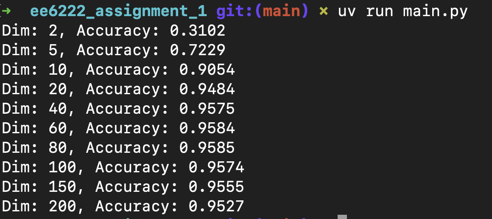
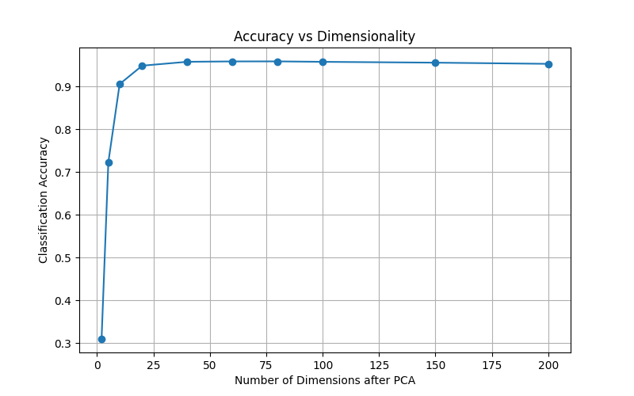

# EE6222 Assignment 1 Report

## Abstract

In this report, I investigated how dimensionality reduction affects the classification performance of high-dimensional data. I applied Principal Component Analysis (PCA) to reduce the dimensionality of a publicly available dataset and evaluated the classification accuracy using a k-nearest neighbor (k-NN) classifier across a range of reduced dimensions. The dataset was preprocessed through normalization and partitioned into separate training and testing sets. All parameters for dimensionality reduction and classification were determined using only the training data, while the testing data was used solely to evaluate performance. A curve illustrating the relationship between classification accuracy and data dimensionality was generated and analyzed. The results showed that moderate dimensionality reduction can improve classification accuracy by removing redundant features and noise, whereas excessive reduction may lead to significant information loss and performance degradation. This study highlights the importance of selecting an appropriate number of dimensions to balance performance and computational efficiency.

## Introduction

High-dimensional data is common in modern machine learning applications, such as image recognition, bioinformatics, and signal processing. However, high dimensionality can introduce challenges such as increased computational cost, overfitting, and the curse of dimensionality, which often degrade the performance of classification algorithms. Dimensionality reduction techniques provide an effective way to address these issues by projecting the data into a lower-dimensional space while preserving the most informative features.

In this study, I explored how dimensionality reduction influences the classification performance of a high-dimensional dataset. Specifically, I applied Principal Component Analysis (PCA), an unsupervised linear projection method that reduces the number of features by retaining the directions of maximum variance. After reducing the dataset into various dimensions, I evaluated classification performance using a k-nearest neighbor (k-NN) classifier.

The aim of this experiment was to analyze the relationship between classification accuracy and the number of dimensions used, and to determine whether dimensionality reduction can improve performance or not. The dataset was properly normalized and split into training and testing sets to ensure a fair evaluation. The final outcome was visualized as a curve showing how classification accuracy varies with the number of dimensions retained after PCA.

## Methodology

### Dataset

For this experiment, I used the MNIST dataset, a well-known benchmark in image classification that contains 70,000 grayscale images of handwritten digits (0–9). Each image is 28×28 pixels, resulting in 784-dimensional feature vectors. I selected this dataset because of its high dimensionality and widespread use in evaluating classification and dimensionality reduction algorithms.

### Preprocessing

Before applying dimensionality reduction and classification, I standardized the data using zero-mean and unit-variance normalization. This preprocessing step was necessary to eliminate bias caused by different feature scales. The dataset was then randomly partitioned into 70% for training and 30% for testing. All parameters used in dimensionality reduction and classification were computed strictly from the training data. The testing data was used only to evaluate the model’s performance.

### Dimensionality Reduction

I applied Principal Component Analysis (PCA) to reduce the data to various lower-dimensional subspaces. PCA identifies the principal components that capture the maximum variance in the data and projects the original features onto those directions. I experimented with a range of dimensions, including 2, 5, 10, 20, 40, 60, 80, 100, 150, and 200 dimensions, in order to observe how dimensionality affects classification performance.

### Classification

For classification, I used the k-nearest neighbor (k-NN) algorithm with k=3k=3, a simple and effective non-parametric method. After dimensionality reduction, I trained the k-NN classifier using the transformed training data, and evaluated it on the correspondingly reduced test data. The classification accuracy at each dimensionality level was recorded.

### Evaluation

To analyze the effect of dimensionality on classification performance, I plotted a curve of classification accuracy versus the number of retained principal components. This visual representation helped reveal trends and identify the point at which further dimensionality reduction began to hurt performance due to information loss.

## Results

The classification accuracies obtained at various PCA-reduced dimensionalities are summarized in Figure 1. As shown, the accuracy increased rapidly as the dimensionality rose from 2 to 40, and then gradually saturated.

<div align="center">
  <br>
  <strong>Figure 1.</strong> Terminal output showing classification accuracy at different PCA dimensions.
</div>


Figure 2 illustrates the classification accuracy as a function of the number of principal components retained after PCA. The curve demonstrates a steep improvement in accuracy at lower dimensions, especially between 2 and 20 dimensions. After 40 dimensions, the accuracy plateaued at around 95.8%, and further increases in dimensionality brought no significant improvement. In fact, a slight decline in accuracy was observed when the number of components exceeded 100, likely due to the inclusion of noise or less informative components.

<div align="center">
  <br>
  <strong>Figure 2.</strong> Classification accuracy versus number of dimensions retained after PCA.
</div>


## Analysis

The experimental results clearly show the influence of dimensionality on classification performance. At very low dimensions (e.g., 2 or 5), a large portion of the original information was lost during projection, leading to poor classification accuracy. For example, when the data was reduced to only 2 dimensions, the accuracy dropped significantly to 31.02%, which suggests that essential discriminatory features were not preserved in such a low-dimensional space.

As the number of principal components increased, the classification accuracy improved rapidly. This indicates that more relevant information for distinguishing between classes was retained in higher-dimensional subspaces. A notable improvement was observed between 5 and 20 dimensions, where the accuracy rose from 72.29% to 94.84%. This demonstrates the effectiveness of PCA in concentrating class-relevant variance in the top few principal components.

The accuracy peaked at 80 dimensions with a value of 95.85%, and remained relatively stable when increasing the dimensionality further. Interestingly, a slight decline in accuracy was observed beyond 100 dimensions. This can be attributed to the fact that additional components started capturing noise or less informative variance, which did not contribute to class separation and may have introduced small distortions in the feature space.

These results highlight a trade-off between retaining enough information for accurate classification and avoiding unnecessary complexity or noise. In this case, reducing the data to 60–80 dimensions was sufficient to achieve near-optimal performance. This not only improves computational efficiency but also helps prevent overfitting, especially when the classifier is simple and the training set is of limited size.

Overall, the findings demonstrate that careful application of dimensionality reduction can enhance classification performance by eliminating redundancy and preserving only the most informative structure in the data.

## Conclusion

In this report, I investigated the effect of dimensionality reduction on the classification performance of high-dimensional data using PCA and a k-nearest neighbor classifier. The experiment was conducted on the MNIST dataset, and classification accuracy was evaluated across a range of reduced dimensions.

The results demonstrated that reducing dimensionality can significantly improve classification efficiency when done properly. Accuracy improved rapidly with increasing dimensions up to around 60–80 components, where it reached a near-optimal level. Beyond this point, additional dimensions provided little to no benefit and even caused slight degradation in performance, likely due to the inclusion of noise and irrelevant variance.

These findings confirm that dimensionality reduction is a valuable preprocessing step in classification tasks involving high-dimensional data. Selecting an appropriate number of dimensions is crucial to balancing performance and computational cost. In practical applications, PCA can be used not only to speed up training and inference but also to improve generalization by focusing on the most informative features.

## References

1. X. Jiang, "[Linear Subspace Learning-Based Dimensionality Reduction](http://www3.ntu.edu.sg/home/EXDJiang/JiangX.D.-SPM-11.pdf)," *IEEE Signal Processing Magazine*, vol. 28, no. 2, pp. 16-26, March 2011.
2. X. Jiang, "[Asymmetric Principal Component and Discriminant Analyses for Pattern Classification](http://www3.ntu.edu.sg/home/EXDJiang/JiangX.D.-PAMI-09P.pdf)," *IEEE Transactions on Pattern Analysis and Machine Intelligence*, vol. 31, no. 5, pp. 931-937, May 2009.
3. X. Jiang, B. Mandal and A. Kot, [Eigenfeature Regularization and Extraction in Face Recognition](http://www3.ntu.edu.sg/home/EXDJiang/JiangX.D.-PAMI-08P.pdf), *IEEE Transactions on Pattern Analysis and Machine Intelligence*, vol. 30, no. 3, pp. 383-394, March 2008.

## Appendix

```python
"""
@file       main.py
@brief      PCA-based dimensionality reduction and classification on MNIST dataset.
@author     You Xuan
@date       March 2025
@version    1.0
@course     EE6222 - Machine Vision
@assignment Assignment 1 – Dimensionality Reduction for Classification

This script performs dimensionality reduction using Principal Component Analysis (PCA)
and evaluates classification accuracy using a k-nearest neighbor (k-NN) classifier.
The accuracy is measured across multiple reduced dimensions and plotted for analysis.
"""

from sklearn.datasets import fetch_openml
from sklearn.decomposition import PCA
from sklearn.model_selection import train_test_split
from sklearn.preprocessing import StandardScaler
from sklearn.neighbors import KNeighborsClassifier
from sklearn.metrics import accuracy_score
import matplotlib.pyplot as plt
import numpy as np


if __name__ == "__main__":
    # 1. 下载数据集
    X, y = fetch_openml("mnist_784", version=1, return_X_y=True, as_frame=False)

    # 2. 数据预处理
    X = StandardScaler().fit_transform(X)
    X_train, X_test, y_train, y_test = train_test_split(
        X, y, test_size=0.3, random_state=42
    )

    # 3. 设置不同降维维度
    dimensions = [2, 5, 10, 20, 40, 60, 80, 100, 150, 200]
    accuracies = []

    for dim in dimensions:
        pca = PCA(n_components=dim)
        X_train_pca = pca.fit_transform(X_train)
        X_test_pca = pca.transform(X_test)

        clf = KNeighborsClassifier(n_neighbors=3)
        clf.fit(X_train_pca, y_train)
        y_pred = clf.predict(X_test_pca)

        acc = accuracy_score(y_test, y_pred)
        accuracies.append(acc)
        print(f"Dim: {dim}, Accuracy: {acc:.4f}")

    # 4. 绘图
    plt.figure(figsize=(8, 5))
    plt.plot(dimensions, accuracies, marker="o")
    plt.xlabel("Number of Dimensions after PCA")
    plt.ylabel("Classification Accuracy")
    plt.title("Accuracy vs Dimensionality")
    plt.grid(True)
    plt.show()
```


